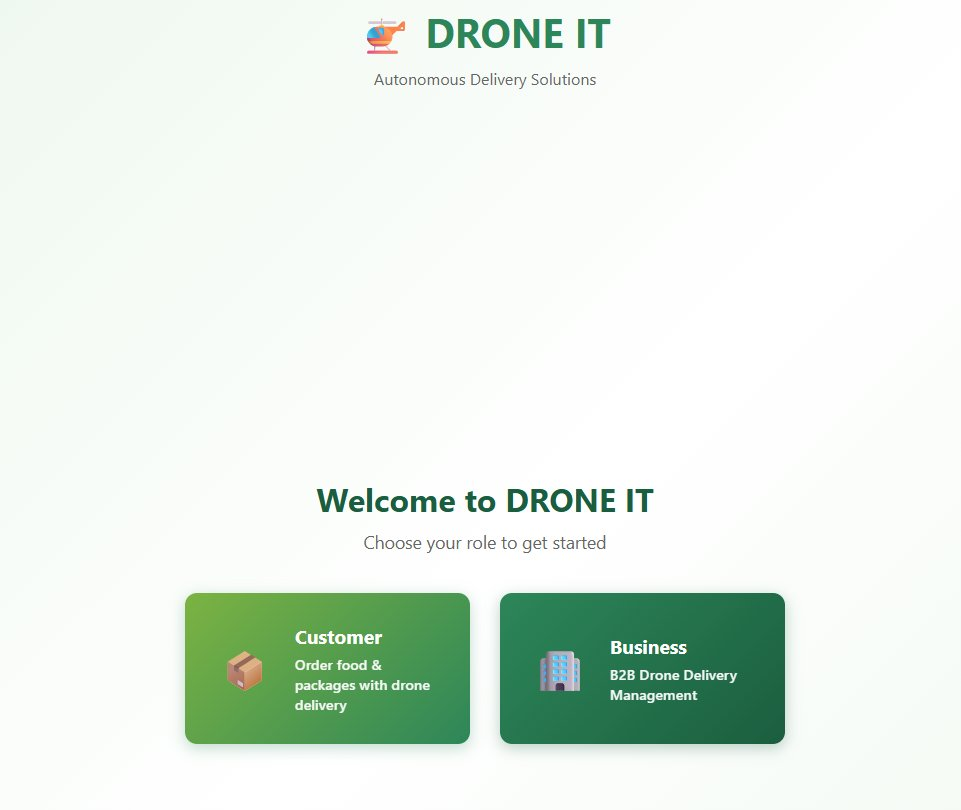
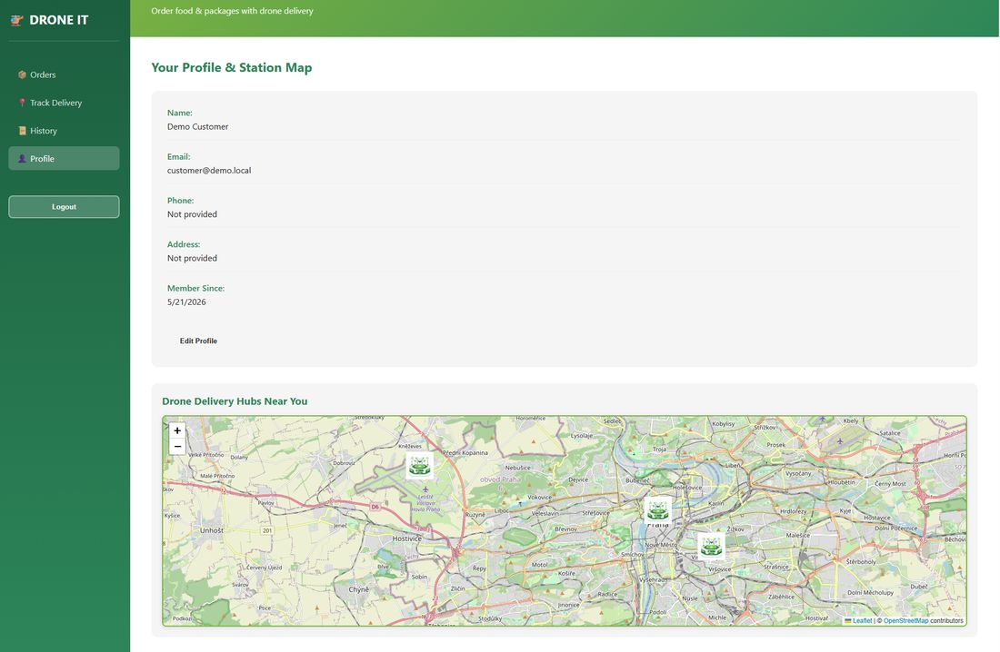

# DRONE-IT — Smart Drone Delivery Hub Platform

Senior project (thesis) prototype: a web platform where urban users find nearby drone delivery hubs on an interactive map and request last-mile deliveries of packages, food, or pharmacy items. Built around the Czech Republic / EU regulatory context (EASA drone airspace rules) as the primary case study.

Full proposal and research write-up (problem statement, research questions, literature review, EASA/EU regulatory analysis, evaluation plan) are in [`docs/proposal.md`](docs/proposal.md).

## Screenshots





## Status

Early-stage prototype built to validate the technical approach for the proposal. Working:

- User registration and login, with separate customer and business account types
- Interactive Leaflet map (React-Leaflet) centered on Prague, rendering drone hub markers from the backend
- Customer and business dashboards, landing page with role selection

Not yet built (planned next, per the project roadmap):

- The actual delivery request/order flow
- EASA no-fly-zone airspace overlay as a toggleable map layer
- Live, fully database-driven hub data (hubs are currently seeded via migration)

## Research questions this project is built around

1. **Regulatory feasibility** — to what extent do current EASA rules permit autonomous drone delivery in urban Czech environments, and how can a software platform represent those constraints for end users?
2. **Smart hub network design** — how should delivery hubs be distributed across a city, and how does hub density affect delivery coverage and convenience?

See the full proposal for scope, methodology, and cited literature.

## Tech stack

- **Frontend:** React (Vite), React Router, React-Leaflet
- **Backend:** Django, Django REST Framework, token-based auth
- **Database:** SQLite for local dev (PostgreSQL planned for the full build)
- **Mapping:** Leaflet.js with GeoJSON for hub and airspace-zone data

## Running it locally

**Backend:**
```bash
cd backend
python -m venv .venv
source .venv/bin/activate  # .venv\Scripts\activate on Windows
pip install django djangorestframework django-cors-headers
python manage.py migrate
python manage.py runserver
```

**Frontend:**
```bash
cd frontend
npm install
npm run dev
```

The frontend expects the backend running on its default port; CORS is pre-configured for `localhost:5173`.

## Notes

- Prepared with AI assistance (Claude) as a writing/drafting aid for the proposal document and repo cleanup; all technical decisions and research conclusions are the author's own — see the proposal's acknowledgements section.
- The `SECRET_KEY` in `backend/backend/settings.py` reads from an environment variable with a clearly-labeled local-only fallback — set `DJANGO_SECRET_KEY` yourself for anything beyond local testing.
